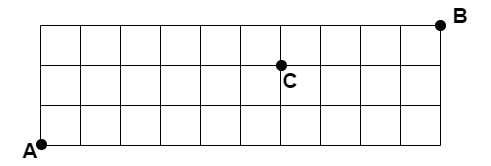

# CSE 280 Prove 13

(c) BYU-Idaho - It is an honor code violation to post this
file completed or uncompleted in a public file sharing site.

**Instructions**: Answer each question using proper markdown notation as needed.  Use the preview view in Visual Studio Code (or another editor if desired) to see the formatting, tables, and mathematical formula properly rendered.  If you need to write code, then first test your code in a separate file and then copy the code into this document using code fences. 

**Name**:

**Section**:

**Teacher**:

## Question 1

Ruth and Ed flip a coin to decide who will do the chores.  Whomever gets Tails has to clean the bathroom.  One day Ed complains that he loses too often.  So Ruth said, "OK, this time you flip two coins and I will flip one coin.  If you get more heads than I do, then I'll clean the bathroom.  Ed likes Ruth's display of generosity and says, "You're on!"  What is the probability that Ed will get more heads and thus not have to clean the bathroom.  Round your answer to the nearest hundreth.

Answer: 

## Question 2
What is the probability of rolling the following scenarios given two fair 6 sided dice?  Round your answer to the nearest hundreth.

|Scenario|Probability|
|:-:|:-:|
|Rolling a sum of 7||
|Rolling two odd numbers||
|Rolling a sum at most 10||

## Question 3
A computer generates a random four-digit string using the uppercase letters `A, B, C, ..., Z`.  What is the probability that the random string contains no vowels `A, E, I, O, U`?  Round your answer to the nearest hundreth.

Answer: 

## Question 4
In a class of 11 boys and 9 girls, the teacher selects three students at random to write problems on the board.  What is the probability that all the students seleted were girls?  Round your answer to the nearest hundreth.

Answer: 

## Question 5
An urn contains five red balls and seven blue balls.  Four balls are drawn at random without replacement.  

**Part A**
What is the probability (to the nearest hundreth) that all four balls are red?

Answer: 

**Part B**
What is the probability (to the nearest hundreth) that two of the balls are red and two are blue?

Answer: 

## Question 7
Odalys sells eggs to restaurants.  Before she sends a package of eggs to a customer, she selects five of the eggs in the package at random and checks to see if they are spoiled.  She won't send the pakage if any of the eggs she tests are spoiled.

**Part A**
Suppose the pakage contains 18 eggs, and half of them are spoiled.  How likely (round to the nearest hundreth) is it that Odalys detects a spoiled egg?

Answer: 

**Part B**
Supose that a package contains 144 eggs, and half of them are spoiled.  How likely is it that Odalys detects a spoiled egg?

Answer: 

## Question 8
Suppose you draw a skittle from one of the three boxes that you choose at random.  The first box contains 1 purple, 3 red, and 4 blue skittles.  The second box contains four purple, two red, and two blue skittles.  The third box contains two purple, one red, and four blue skittles.  What is the probability that you selected the first box if you got a red skittle.  In other words what is the probability of selecting the first box given that a red skittle was selected.  Round your answer to the nearest hundreth.

Answer:  

## Question 9

Consider the following road grid in which you can only go right and up.  Given a randomly selected route between points A and B, what is the probability (round to the nearest hundreth) that you will go through point C?

Answer: 

## Question 10

The probability of a seed germinating is $5/6$.  The probability of a seed germinating and producing fruit is $1/8$.  What is the probability that a seed will produce fruit (round to the nearest hundreth)?

Answer: 